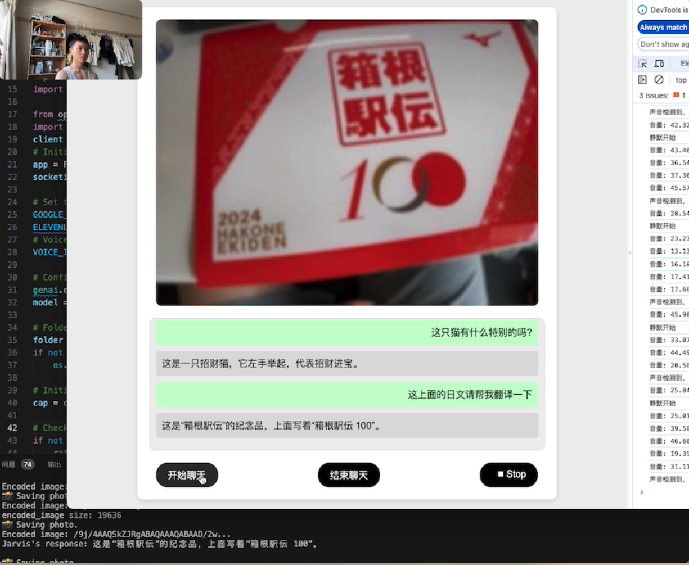

# Free-Astra

## 项目介绍

在 GPT-4 的视频聊天功能尚未上线之际，开发了一个简易版本。借鉴谷歌发布的多模态 AI 项目 Project Astra，构建了一个基础的视觉聊天模型。该模型可以根据摄像头捕获的图像和用户的语言进行互动，并实时生成语音输出。目前，模型的英语效果最佳，中文也有一定的支持。演示程序未经加速和剪辑，虽然视觉反应较快，但文字转语音存在延迟。

基于 Github 项目 DIY-Astra 进行改进，现在用户可以使用摄像头自由聊天。Gemini 1.5 Flash 的效果非常出色，不敢想象以后手机、甚至个人穿戴设备都被这些低功耗AI模型改造一遍的时代。

本项目视频演示地址：https://www.bilibili.com/video/BV1Nn4y1o7CK/?vd_source=97fb05507112998874bd946470f720ff
DIY-Astra 项目地址：https://github.com/Doriandarko/DIY-Astra

Free-Astra 是一个基于DIY-Astra（后文有详细介绍）开发而来的 Flask 应用程序，利用计算机视觉和自然语言处理创建一个交互式 AI 助手。该应用程序从网络摄像头捕获实时视频流，使用 Google AI API 分析捕获的图像，并根据视觉输入生成文本响应。生成的文本响应随后使用 ElevenLabs API 转换为音频，并播放给用户。

## 功能
- 采用静默检测算法，实现自由录音
- 集成 OpenAI 的 Whisper 实现语音转文本
- 从网络摄像头捕获实时视频流
- 使用 Google AI API 进行图像分析
- 根据视觉输入生成文本
- 使用 ElevenLabs API 将文本转换为语音
- 实时播放生成的音频响应
- 基于 Web 的用户界面进行交互和控制


## 需求
要运行 Free-Astra 应用程序，您需要安装以下依赖项：
- Python 3.x
- Flask
- Flask-SocketIO
- OpenCV (cv2)
- Pydub
- Google Generative AI Client Library
- Pillow (PIL)
- Requests
- openai

需要拥有以下服务的有效 API 密钥：
- Google AI API (GOOGLE_API_KEY)
- ElevenLabs API (ELEVENLABS_API_KEY)
- OpenAI API  (OPENAI_API_KEY)
请将这三个密钥添加到项目根目录的 `.env` 文件中，并由操作系统读取：

## 安装
1. 克隆仓库：
   ```bash
   git clone https://github.com/your-username/free-astra.git
   ```

2. 进入项目目录：
   ```bash
   cd free-astra
   ```

3. 安装所需的依赖项：
   ```bash
   pip install -r requirements.txt
   ```

4. 设置 API 密钥：
   - 在 `.env` 文件中设置您的 Google AI API 密钥、 ElevenLabs API 密钥和 OpenAI API 秘钥。
类似如下方式：
```
GOOGLE_API_KEY = ''
ELEVENLABS_API_KEY = ''
OPENAI_API_KEY = ''
```

5. 运行应用程序：
   ```bash
   python app.py
   ```

6. 打开您的网络浏览器并导航到 `http://localhost:5001` 以访问 free-astra 界面。

## 使用方法
1. 确保您的网络摄像头已连接并可访问。
2. 运行 `python app.py` 启动 free-astra 应用程序。
3. 应用程序将在您的默认浏览器中打开。
4. 网络摄像头的实时视频流将显示在界面中。
5. 点击“开始”按钮，开始聊天。说话结束录音自动发送后端分析。
6. free-astra 将连续捕获图像，使用 Google AI API 进行分析，并根据视觉输入生成文本响应。
7. 生成的文本响应将显示在视频流下方的文本容器中。
8. 文本响应也将使用 ElevenLabs API 转换为音频并实时播放。
9. 您可以通过点击界面中的“停止”按钮停止应用程序。要恢复，请点击“恢复”按钮。

## 文件结构
- `app.py`: 包含服务器端逻辑的主 Flask 应用程序文件。
- `templates/index.html`: 用户界面的 HTML 模板。
- `static/css/styles.css`: 用于样式化用户界面的 CSS 样式表。
- `static/js/script.js`: 用于客户端交互和套接字通信的 JavaScript 文件。
- `requirements.txt`: 所需的 Python 依赖项列表。

### 加入新内容后的 README 文件中文版

```markdown
# DIY-Astra

趁GPT-4的视频聊天功能还没上线，先缝一个丐中丐版本。模仿前两天谷歌发布会的多模态AI项目Project Astra，粗略挫了个视觉聊天模型。现在能跟他自由交谈，它会根据摄像头拍到的画面与使用者的语言进行反映，并实时声音输出。目前英语效果是最好的，中文也算能支持。演示程序未加速未剪辑，视觉反映过程比较快，但是文转声会有延迟。
在Github项目DIY-Astra的基础上进行改进，现在可以做到拿着摄像头自由聊天。
目前感觉Gemini 1.5 Flash效果不错，不敢想象以后手机、甚至个人穿戴设备都被这些低功耗AI模型改造一遍的时代。
本项目Github地址：
本项目视频演示地址：
DIY-Astra地址：https://github.com/Doriandarko/DIY-Astra

开发优化：
1. [ ] 加入openai的whisper来音转文
2. [ ] 后端逻辑修改
3. [ ] 前端界面优化，更像一个对话界面。
4. [ ] 去掉录音按钮，freestyle。

- 需要使用openai的apikey。把三个key放在的根目录的.env文件中，然后os系统读取。

## 项目介绍
DIY-Astra 是一个 Flask 应用程序，利用计算机视觉和自然语言处理创建一个交互式 AI 助手。该应用程序从网络摄像头捕获实时视频流，使用 Google AI API 分析捕获的图像，并根据视觉输入生成文本响应。生成的文本响应随后使用 ElevenLabs API 转换为音频，并播放给用户。

## 功能
- 从网络摄像头捕获实时视频流
- 使用 Google AI API 进行图像分析
- 根据视觉输入生成文本
- 使用 ElevenLabs API 将文本转换为语音
- 实时播放生成的音频响应
- 基于 Web 的用户界面进行交互和控制

## 需求
要运行 DIY-Astra 应用程序，您需要安装以下依赖项：
- Python 3.x
- Flask
- Flask-SocketIO
- OpenCV (cv2)
- Pydub
- Google Generative AI Client Library
- Pillow (PIL)
- Requests

您还需要拥有以下服务的有效 API 密钥：
- Google AI API (GOOGLE_API_KEY)
- ElevenLabs API (ELEVENLABS_API_KEY)

## 安装
1. 克隆仓库：
   ```bash
   git clone https://github.com/your-username/diy-astra.git
   ```

2. 进入项目目录：
   ```bash
   cd diy-astra
   ```

3. 安装所需的依赖项：
   ```bash
   pip install -r requirements.txt
   ```

4. 设置 API 密钥：
   - 在 `.env` 文件中设置您的 Google AI API 密钥和 ElevenLabs API 密钥。

5. 运行应用程序：
   ```bash
   python app.py
   ```

6. 打开您的网络浏览器并导航到 `http://localhost:5001` 以访问 DIY-Astra 界面。

## 使用方法
1. 确保您的网络摄像头已连接并可访问。
2. 运行 `python app.py` 启动 DIY-Astra 应用程序。
3. 应用程序将在您的默认浏览器中打开。
4. 网络摄像头的实时视频流将显示在界面中。
5. DIY-Astra 将连续捕获图像，使用 Google AI API 进行分析，并根据视觉输入生成文本响应。
6. 生成的文本响应将显示在视频流下方的文本容器中。
7. 文本响应也将使用 ElevenLabs API 转换为音频并实时播放。
8. 您可以通过点击界面中的“停止”按钮停止应用程序。要恢复，请点击“恢复”按钮。

## 文件结构
- `app.py`: 包含服务器端逻辑的主 Flask 应用程序文件。
- `templates/index.html`: 用户界面的 HTML 模板。
- `static/css/styles.css`: 用于样式化用户界面的 CSS 样式表。
- `static/js/script.js`: 用于客户端交互和套接字通信的 JavaScript 文件。
- `requirements.txt`: 所需的 Python 依赖项列表。

## DIY-Astra 大致流程
这个代码是一个基于Flask和SocketIO的实时图像捕获和分析系统，它使用Google的生成模型和ElevenLabs的文本转语音API来处理图像并生成音频反馈。以下是它的流程和主要功能：

1. **引入必要的库**：
   - `os`，`cv2`（OpenCV），`threading`，`base64`，`time`，`requests`，`flask`，`pydub`，`google.generativeai`，`PIL`，`numpy`等。

2. **初始化Flask应用和SocketIO**：
   ```python
   app = Flask(__name__)
   socketio = SocketIO(app, cors_allowed_origins='*')
   ```

3. **配置API密钥**：
   - 设置Google生成模型和ElevenLabs的API密钥和语音ID。

4. **配置Google生成模型客户端**：
   ```python
   genai.configure(api_key=GOOGLE_API_KEY)
   model = genai.GenerativeModel('models/gemini-1.5-flash-latest')
   ```

5. **创建用于保存帧的文件夹**：
   ```python
   folder = "frames"
   if not os.path.exists(folder):
       os.makedirs(folder)
   ```

6. **初始化网络摄像头**：
   - 打开摄像头并检查是否成功打开。

7. **创建队列和标志**：
   - `text_queue`用于存储文本响应。
   - `audio_playing`标志用于指示音频播放是否正在进行。

8. **定义图像编码函数**：
   - 将图像文件编码为Base64格式。

9. **生成音频函数**：
   - 使用ElevenLabs API将文本转换为音频并保存为文件。

10. **播放音频函数**：
    - 从队列中获取文本并生成相应的音频播放。

11. **生成新的消息行函数**：
    - 创建包含用户图像请求的消息内容。

12. **图像分析函数**：
    - 使用Google生成模型分析编码后的图像，并返回响应文本。

13. **图像捕获函数**：
    - 从摄像头捕获图像，进行预处理和编码，发送到SocketIO客户端并分析图像，生成文本响应并存入队列。

14. **Flask路由**：
    - `/`：返回主页模板。
    - `/stop`：停止图像捕获。
    - `/resume`：恢复图像捕获。
    - `/set_interval`：设置图像捕获间隔。

15. **主程序**：
    - 启动图像捕获和音频播放的线程，打开默认浏览器到服务器链接，并运行Flask应用。


## 贡献
欢迎贡献！如果您发现任何问题或有改进建议，请打开问题或提交拉取请求。

## 许可证
本项目使用 MIT 许可证。
